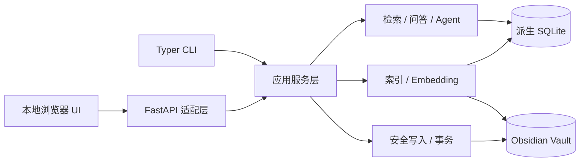

# ObsAgent 本地前端技术方案

状态：设计提案；尚未开始实现。基于当前 V1 CLI 代码与原 PRD 的 local-first、Vault 为事实源、写入必须审批原则。前端是 ObsAgent 的可视化入口，不替代 Obsidian 编辑器，也不废弃 `obsai` 命令。

## 1. 目标与边界

目标是让用户在本地浏览器中完成状态查看、检索、问答、索引管理、Inbox 整理、笔记安全修改、Agent 审批和事务恢复。CLI 与前端共享同一套 Python 应用服务、配置、索引和 Vault，不维护两份业务规则。

首版不做远程账户、云端托管、多用户协作、移动端或 Obsidian GUI 替代。前端本身不读取任意本机路径，不直接写 Vault 或 SQLite，不执行 Markdown 中的代码。远程 LLM/embedding 的数据边界与 CLI 一致：仅在对应操作获准时发送查询或被选中的证据，绝不上传整个 Vault。

## 2. 现状与改造量

当前 `src/obsai/vault/`、`chunking/`、`storage/`、`retrieval/`、`answering/`、`safe_write/`、`transactions/`、`organizer/` 和 `agent/` 已有可复用的核心能力，新的前端无需重写解析、检索、引用校验和 OCC/回滚。主要耦合集中在 `src/obsai/cli/app.py`：它负责组装服务，也直接执行 `typer.confirm`、Rich 输出、远程查询确认、整理选择与 diff 展示。`InboxOrganizer.apply()` 和 Agent 工具的低层执行方法本身不应直接暴露为 HTTP 写接口；审批必须由更高层统一验证。

后端改造预期为**中等**：增加应用编排层、本地 API 层、任务与审批状态、跨进程协调；尽量不改动领域模型。前端界面和长任务体验通常比 Python 核心改造耗时更多。

## 3. 技术选择

| 部分 | 建议 | 理由 |
| --- | --- | --- |
| 本地服务 | FastAPI + Pydantic 请求/响应模型 | 与现有 Python/Pydantic 栈一致，接口可生成 OpenAPI 文档；仅作为适配层，不包含业务规则。[官方说明](https://fastapi.tiangolo.com/tutorial/body/) |
| 前端 | React + TypeScript + Vite | 适合搜索结果、证据引用、diff、任务进度和多步审批；部署为本地静态资源，与 API 同源。具体组件库在视觉设计阶段确定。 |
| 任务进度 | HTTP 创建任务 + `GET /jobs/{id}`；首版用 SSE 推送事件，断线后可轮询恢复 | 单向进度比双向 WebSocket 简单；取消和审批仍使用普通 POST。 |
| API 生命周期 | 单进程服务，启动时检查恢复状态，退出时停止调度并关闭资源 | FastAPI 的 lifespan 支持启动/关闭清理。[官方说明](https://fastapi.tiangolo.com/advanced/events/) |
| 桌面封装 | 暂缓；后续可评估 Tauri + Python sidecar | 先验证 UI 流程，避免首版承担 Python 与 sqlite-vec 的跨平台打包成本。[Tauri sidecar 文档](https://v2.tauri.app/zh-cn/develop/sidecar/) |

生产运行只绑定 `127.0.0.1`，服务同时托管构建后的前端文件和 `/api/v1`。开发时 Vite 通过代理调用本地 API；发布时同源，避免宽松 CORS。CLI 入口 `obsai = obsai.cli.app:main` 保留，新增入口可命名为 `obsai ui` 或独立 `obsai-ui`；二者都调用共享应用层。

建议增设 `src/obsai/application/`（搜索与问答编排、审批、作业协调）、`src/obsai/api/`（路由、DTO、异常映射、安全中间件）和 `web/`（前端）。领域服务返回结构化结果；CLI 再负责终端呈现，API 负责 JSON/SSE 呈现。避免让 API 调用 `CliRunner`、子进程 `obsai ...` 或解析 Rich 文本。

## 4. 界面范围

1. **概览**：Vault 路径、索引/向量代状态、dirty notes、未完成事务、最近任务。
2. **搜索与问答**：keyword/semantic/hybrid 模式、标签/目录过滤、结果定位、引用跳转；语义查询发送前显示远程调用确认。
3. **索引**：增量更新、shadow rebuild、embedding 预估与预算、进度/取消/错误状态；重建后明确提示向量需重新生成。
4. **Inbox 整理**：提案列表、置信度、受影响 backlink、选择子集、分段 diff；一次批准对应一次逻辑事务。
5. **安全写入与 Agent**：计划、diff、受影响文件、批准/拒绝；Agent 显示工作流 ID、停止原因和待审批状态。
6. **恢复**：事务 journal、index dirty、shadow 残留的可见状态；恢复前展示快照差异。

Markdown 预览只显示经过安全渲染的内容；默认不启用原始 HTML、脚本或外部资源自动加载。引用与 WikiLink 点击只能打开经过服务端校验的 Vault 内目标。

## 5. API 契约草案

全部接口以 `/api/v1` 开头，采用 Pydantic DTO、统一错误码与 request ID。返回 note ID、chunk ID、Vault 相对路径、引用 ID 等结构化数据；不把绝对本机路径、API key 或内部 traceback 发给浏览器。分页查询必须有上限。

| 端点 | 用途 | 说明 |
| --- | --- | --- |
| `GET /status` | Vault、索引、恢复状态 | 只读；不自动执行恢复 |
| `POST /search/preflight`、`POST /search/consents/{id}/approve` | 查询远程发送预估与用户同意 | 预估返回 token/cost；批准后签发绑定 query 哈希、模型代和过期时间的一次性凭据；keyword 无需调用 |
| `POST /search` | keyword/hybrid/graph 搜索 | 请求含 query、mode、limit、filters；需远程 query embedding 时附有效凭据，否则明确降级或报错 |
| `POST /ask` | Retrieve → ContextBuilder → LLM | 返回 answer、sources、degraded warnings；保留现有引用校验 |
| `GET /notes/{note_id}` | 读取解析后的笔记 | 服务端检查当前 Vault/索引状态与忽略规则 |
| `POST /jobs/index-update`、`/jobs/index-rebuild` | 创建索引任务 | 返回 job ID；同类写任务互斥 |
| `POST /embedding/plans` | 远程 embedding 预估 | 返回 chunk 数、tokens、cache hits、请求数、估算成本、模型代 |
| `POST /embedding/plans/{id}/approve` | 批准并启动 embedding | 服务器重新计算计划与预算；变化时要求重新确认 |
| `GET /jobs/{id}`、`/events`、`POST /jobs/{id}/cancel` | 查询、订阅、取消 | 断线不等于取消；取消走现有安全边界 |
| `POST /organize/proposals` | 生成 Inbox 提案 | 只读，不修改 Vault |
| `POST /changes/plans`、`GET /changes/plans/{id}` | 生成/查看写入计划 | 服务端保存短期计划，返回 diff 与原始哈希摘要 |
| `POST /changes/plans/{id}/approve` | 执行用户已看过的计划 | 服务端重验 nonce、计划版本、路径、OCC、冲突与权限；仅能调用 TransactionService |
| `POST /agent/runs`、`POST /agent/runs/{id}/resume` | Agent 执行与 HITL 恢复 | 只恢复已有 checkpoint；批准前必须重新展示预览 |
| `GET /transactions`、`POST /transactions/{id}/recover` | 检查/恢复 journal | 恢复也需要预览与独立确认 |

示例：创建写入计划返回 `plan_id`、`expires_at`、`revision`、`affected_paths`、`diff_summary` 和 `diff`。前端提交批准时只传 `plan_id`、`revision` 与一次性确认 nonce，**不传最终文件内容让服务器照写**。计划短期存于服务端；重启后普通待审批计划失效并重新生成。Agent 使用现有 checkpoint 恢复，不把 checkpoint 当文件事务 journal。

HTTP 错误至少区分：`400` 参数错误、`401/403` 本地会话/来源拒绝、`404` 目标不存在、`409` OCC/目标冲突/索引代变化、`423` Vault 操作锁占用、`429` 远程预算或节流、`500` 内部错误。拒绝或过期审批绝不能触发写入。

## 6. 长任务、并发与恢复

长任务采用单进程、有上限的 job runner。任务状态为 `queued → running → succeeded / failed / cancelled`，必要时可进入 `awaiting_approval`。任务记录只保存类型、进度、时间、汇总指标与错误码；不保存笔记正文。前端刷新后通过 job ID 重新获取进度。首版不引入 Celery、Redis 或云队列。

必须补足 **CLI 与 UI 的跨进程操作锁**。同一 Vault 的文件事务和索引写入不能因两个入口同时运行而互相覆盖；shadow rebuild 与普通 index update、embedding 写入互斥。读请求使用短生命周期数据库连接，重建 swap 后新请求重新打开索引。SQLite 配置 busy timeout，并对 `SQLITE_BUSY` 给出可见错误或有界重试。现有 rebuild 锁只保护 rebuild 本身，不能替代这一层全局协调。

取消使用协作式令牌：停止安排新 batch/文件操作，等待当前安全单元结束，再回滚开放的文件事务；远程请求受 timeout 约束。服务关闭时调用同一取消机制并关闭 DB/日志。进程硬退出后，启动检查 `.building`、事务 journal、index dirty 和未完成 job；前端显示“需要恢复”，不能假装任务成功。Vault 事务成功而索引失败时保持 Vault 提交，标记 dirty，并提供重新索引入口。

Shadow rebuild 会替换派生索引并使旧向量失效；当前实现也会重新生成 note/chunk ID。方案须选择：优先在健康旧索引可读时迁移稳定 ID；否则至少以 `index_generation` 标识新代，令 UI 缓存、待审批计划和引用旧 ID 的 Agent 工作流失效并要求重新查询。不能在索引换代后悄悄使用旧 note ID。

## 7. 安全与隐私

- 本地服务仅监听 loopback；校验 `Host` 与 `Origin`，生产模式默认不开放跨域。每次状态变更使用随机会话凭据和一次性/短期确认 nonce；不把“绑定 localhost”当作唯一授权。FastAPI 官方特别说明本地、无认证 API 的 CSRF 风险；JSON `Content-Type` 严格校验只是其中一道防线。[严格 Content-Type 与 CSRF 说明](https://fastapi.tiangolo.com/advanced/strict-content-type/)；[CORS 说明](https://fastapi.tiangolo.com/tutorial/cors/)。
- 前端绝不传任意绝对路径给写工具；服务端仍调用 SafeWriteService/TransactionService 做路径、符号链接、碰撞、OCC、审批与回滚检查。Web 路由不能直接调用 `Path.write_text()` 修改 Vault。
- 不把笔记正文、检索摘要或网页内容提升为系统指令；API 侧复用 ContextBuilder 的“不可信证据”边界和 Agent 的意图/工具权限检查。
- 不持久化 OpenAI API key 到浏览器本地存储；优先沿用服务进程的环境变量。日志、job 事件和错误响应不包含 key、全文笔记或原始 provider 请求。
- 批量 diff 先展示摘要，再按文件按需读取；防止巨量内容直接推到浏览器。Markdown 渲染禁用脚本、原始 HTML 和不受控外部资源。
- 明确本地威胁模型：拥有同一用户文件系统权限的恶意进程不在首版隔离能力内；远程访问与局域网共享不在范围内。

## 8. 实施阶段与验收

| 阶段 | 交付 | 预计人日* | 必须通过的验收 |
| --- | --- | ---: | --- |
| A. 应用服务抽取 | 把 CLI 中的搜索、问答、远程确认、组织审批编排抽为结构化服务；CLI 保持原命令与输出 | 4–6 | 现有 CLI 测试全过；无 CLI 文本解析依赖 |
| B. 只读 UI | 本地 API、状态、keyword/hybrid 搜索、问答、引用、笔记查看 | 5–7 | 不触碰真实 HOME；无 API key 仍可 keyword；引用可定位 |
| C. 任务与成本 | index update/rebuild、embedding 计划/批准、进度与取消 | 4–7 | 取消保留旧索引；预算变化后重新确认；CLI/UI 互斥 |
| D. 写入与整理 | 计划/diff/批准、Inbox 子集、事务恢复 | 6–9 | 拒绝时 Vault 字节不变；冲突返回 409；失败回滚；索引失败标 dirty |
| E. Agent UI | workflow 状态、checkpoint resume、HITL、停止原因 | 4–7 | 循环有界；页面刷新可恢复待审批；恶意笔记不能触发只读请求写入 |
| F. 发布加固 | 安全、性能、浏览器测试、文档与打包脚本 | 4–8 | CLI 与 UI 并行回归、异常退出恢复、10k/100k 数据集基本响应 |

*单人全职开发的规划区间，共约 **27–44 人日（5–9 周）**；视觉设计、第三方 UI 组件采购、跨平台桌面安装包另计。先交付 A+B 的只读本地浏览器版约 **9–13 人日**。正式排期应在 A 阶段结束后以实际 API/并发改造结果重估。

测试分层：应用服务单测（mock provider）、API contract 测试（隔离 HOME/Vault/DB）、浏览器端到端测试（审批与断线）、CLI/UI 双进程并发与故障注入。每次里程碑均运行现有 pytest；不调用真实 OpenAI，不写用户真实 Vault。

## 9. 发布门槛

只有以下条件同时满足才启用可写 UI：CLI 命令继续可用；前端与 CLI 共用业务服务；所有写入有服务端生成的预览和用户批准；OCC、路径限制、事务回滚、index dirty、shadow rebuild 恢复均通过跨入口测试；远程 embedding 有成本和预算确认；本地 API 不被其他网页直接驱动；Agent 仍有步数与工具权限上限。任一条件未满足时先发布只读 UI。
